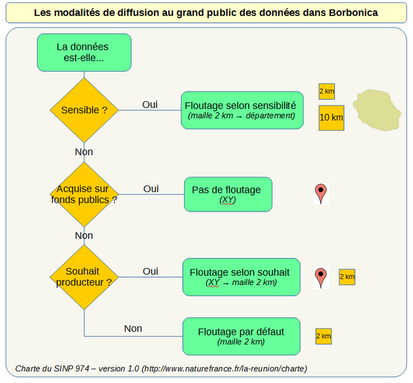
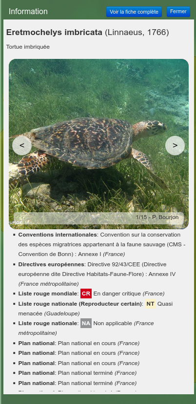

# Naturaliz - Guide d'utilisation

## Jeux de données

Pour pouvoir faire le suivi des données importées et caractériser notamment leurs métadonnées,
il est important pour chaque jeu de données de créer des enregistrements dans les deux tables suivantes :

* `occtax.cadre`: elle recense les **cadres d'acquisition**
* `occtax.jdd`: elle recense les **jeux de données**. Un jeu de données doit référencer un cadre d'acquisition.

Les données à insérer doivent correspondre aux informations saisies sur le site officiel de l'INPN.

## Import de données

### Import manuel via des scripts SQL

Lors de l'installation, une structure de données conforme au standard **"Occurrences de taxon"** a été créée dans la base de données.
Pour pouvoir exploiter l'application, il faut **importer des données d'observations**.


Une fois les données importées, il faut absolument **rafraîchir certaines vues matérialisées** utilisées par l'application.

```sql

-- Vue qui rassemble à plat dans une seule entité la plupart des informations sur les observations
REFRESH MATERIALIZED VIEW occtax.vm_observation;

```

### Import assisté depuis l'interface Web

Une entrée de menu permet de proposer à l'utilisateur ayant les droits requis de téléverser dans l'application un fichier CSV,
puis de lancer :

* la **validation** de la structure et des données du jeu de données : champs requis, format des données,
  respect des règles du standard "Occurrences de Taxon"
* l'**import** des données dans la base, avec un statut "À activer". Les observations importées
  ne seront visibles que par les administrateurs de la base dans l'application.

Pour que l'utilisateur en ligne puisse réaliser l'**import** des données dans la base,
il est nécessaire que le jeu de données
soit au préalable ajouté dans la table `occtax.jdd`, avec la bonne valeur dans le champ `jdd_metadonnee_dee_id`.

Le fichier CSV doit correspondre à un modèle bien spécifique, avec une liste minimale de champs, nommés correctement.
Un fichier CSV exemple est disponible dans les sources et peut être téléchargé depuis le formulaire.

Lorsque l'utilisateur a validé le format des données, et qu'il lance l'import, une **vérification des observations** est lancée
pour vérifier si les observations du CSV ne sont pas déjà présentes dans la base de données. Les champs testés sont les suivants :
`cd_nom, date_debut, heure_debut, date_fin, heure_fin, longitude, latitude`. Si des observations sont déjà présentes avec
ces critères dans la base, un message d'erreur est renvoyé avec le nombre d'observations en doublons.

#### Outils SQL pour gérer les observations importées

Une fois le fichier CSV importé avec succès dans la base de données, depuis le formulaire,
**les données ne sont pas encore visibles pour les utilisateurs**. Elles ont en effet été importées
avec un statut "à activer", via la présence de propriétés spécifiques dans le champ `odata`
de la table `occtax.observation`.

Voici un exemple de contenu du champ `odata` pour ces observations non validées :

```json
{
  "import_time": "2022-04-29T15:09:59",
  "import_login": "dupont",
  "import_temp_table": "temp_1651259398_target"
}
```

On peut avoir une **vue synthétique** des données à activer via la vue `occtax.v_import_web_liste` :

```sql
SELECT * FROM occtax.v_import_web_liste;
```

qui renvoie le contenu suivant (la géométrie, lourde, a été masquée ici) :

```
date_import         | 2022-04-29 15:09:59
jdd                 | DCB578EC-84AE-2545-E053-3014A8C03597
nombre_observations | 10
code_import         | temp_1651259398_target
login_import        | dupont
geom                | [...]
```

On peut afficher dans QGIS la vue `occtax.v_import_web_observations` qui sélectionne l'ensemble
de **toutes les observations à activer**. Cela permet de confirmer que l'import CSV a bien enregistré
les observations, et qu'elles contiennent les bonnes données.

Si on le souhaite, on peut aussi ajouter cette vue au projet QGIS qui est publié pour
l'application Naturaliz via Lizmap Web Client, en ne la rendant accessible qu'au groupe `admins`.
Cela permet de visualiser directement dans l'interface Web l'ensemble des données à valider.
On peut aussi ajouter une "popup" pour cette couche, pour permettre d'interroger les données
d'une observation en cliquant sur la carte.

NB: un projet QGIS de gestion dédié a été créé et publié sur l'application. Il offre les outils
pour faire le suivi des imports.

Une fois les données contrôlées manuellement, il est possible d'**activer ces données**
pour qu'elles soient visibles par les utilisateurs de Naturaliz, en fonction de leurs droits.
Pour cela, on peut lancer la commande SQL suivante qui appelle une fonction spécifique et
va supprimer du champ `odata` les propriétés caractéristiques de l'import CSV :

```sql
SELECT occtax.import_activer_observations_importees(
    -- Nom de la table temporaire, visible dans la vue occtax.v_import_web_liste
    'temp_1651259398_target',
    -- UUID du JDD, visible dans la table occtax.jdd
    'DCB578EC-84AE-2545-E053-3014A8C03597'
) AS nombre_lignes
;
```

Au contraire, on peut souhaiter ne pas activer ces observations importées.
Pour **supprimer les données importées**, si on veut les supprimer la base de données,
on peut lancer la commande suivante :

```sql
SELECT occtax.import_supprimer_observations_importees(
    -- Nom de la table temporaire, visible dans la vue occtax.v_import_web_liste
    'temp_1651259398_target',
    -- UUID du JDD, visible dans la table occtax.jdd
    'DCB578EC-84AE-2545-E053-3014A8C03597'
);
```

Il suffit alors de rafraîchir les vues `occtax.v_import_web_liste` et `occtax.v_import_web_observations`
pour visualiser les modifications.


#### Projet QGIS de gestion publié dans Lizmap: gestion, imports, vues matérialisées

Un [projet QGIS](gestion/gestion.qgs) de gestion des données, avec [sa configuration Lizmap](gestion/gestion.qgs.cfg)
et la [configuration du module action](gestion/gestion.qgs.action) peut être publié dans l'application Lizmap.

Il fournit une interface de **consultation** et de **modification** des **données de gestion** et propose aussi
des formulaires d'édition pour modifier les données du schéma `gestion` : acteurs, organismes, personnes, demandes, etc.

Il comporte aussi un groupe de couches `Imports CSV web` qui contient 2 couches :

* la couche **Imports à activer** issue de la vue `v_import_web_liste` montre sur la carte
  les polygones de chaque import (englobant les observations de chaque import Web)
* la couche **Observations importées à activer** issue de la vue `v_import_web_observations`
  montre les observations importées (mais pas activées)

On peut cliquer sur le nom des couches dans la légende, ce qui ouvre un panneau.
Un bouton permet de zoomer sur l'emprise des données

Quelques points-clés :

* les 2 couches ont une **"popup"** Lizmap configurée : on peut cliquer sur la carte,
  et on voit les informations de l'objet sous le clic, qui s'affichent dans le panneau de gauche.
* Pour **supprimer** les observations d'un import CSV, ou au contraire pour **activer ces observations** :
  on clique sur le polygone de l'import CSV à traiter
* Cela ouvre la popup : on voit les informations de l'import (date de l'import, login, nombre d'observations, etc.)
* Dans la barre d'outil de la popup, pour chaque objet, on voit apparaître 2 boutons
  avec une infobulle au survol qui permettent de lancer une action :
  "poubelle" pour supprimer et "pouce en l'air" pour activer
* On peut cliquer sur un des boutons pour lancer l'action choisie.
  Un message demande confirmation, et si vous validez, l'action sera lancée
* Un message de confirmation s'affiche une fois l'action effectuée.
* La carte est rafraîchie et l'import ainsi que ses observations disparaissent,
  ce qui montrent qu'elles ont été traitées.

Enfin, ce projet offre 2 autres couches avec une popup :

* couche `Métadonnées / ZEE` : en cliquant sur la ZEE dans la carte, on peut via
  le bouton d'action de la popup **rafraîchir les vues matérialisées**
* couche `Métadonnées / Jeux de données` : c'est une vue qui montre l'emprise de
  l'ensemble des observations pour chacun des jeux de données. On peut cliquer sur un polygone,
  puis chercher les informations concernant le JDD souhaité. Un bouton d'action permet
  de **supprimer toutes les observations du JDD**. C'est utile notamment si on souhaite réimporter
  toutes les observations via l'outil d'**import CSV** en ligne.


## Gestion de la sensibilité des données

Les modalités de diffusion des données sont définies par la charte régionale du SINP.
Cette dernière prévoit deux niveaux d’accès : experts et professionnels, ou grand public.
Les experts et professionnels accèdent aux données précisément géolocalisées
sur la base d’une demande à formuler sur Borbonica.
Les adhérents à la charte régionale bénéficient d’un accès facilité.
Le grand public accède aux données à des données moins précises.
Le niveau de diffusion au grand public résulte de la combinaison de plusieurs paramètres,
hiérarchisés ci-dessous (du plus important au moins important) :

* **statut de validation** de la donnée (champ `validite_niveau`) : seules les données
  dont la validité est ‘Certaine’ ou ‘Probable’ sont visibles ;
* **sensibilité de la donnée** (champ `sensi_niveau`) : les données relatives
  à des taxons menacés faisant l’objet d’atteintes directes ou indirectes (braconnage, dérangement…)
  sont floutées. Voir ci-dessous ;
* **statut public ou privé** de la donnée (champ `ds_publique`) : les données publiques
  sont diffusées sans floutage ;
* **souhait de diffusion du producteur**` (champ `diffusion_niveau_precision`) :
  le producteur peut souhaiter une diffusion avec la précision géographique d’origine ou après floutage à la maille de 2 km.

Le logigramme suivant synthétise les différents cas de figure possibles:




### Calcul automatique de sensibilité selon des critères

La sensibilité des observations peut être décidée pendant l'import des données,
ou bien après l'import, via une liste de conditions pré-établie.
La sensibilité des observations dépend en effet de nombreux critères sur les taxons,
la position de l'observation, les commentaires, et d'autres conditions spécifiques.

L'application Naturaliz permet de stocker l'ensemble des critères de sensibilité dans
la table `occtax.critere_sensibilite`, puis de les utiliser pour calculer automatiquement la sensibilité
de chaque observation via une fonction PostgreSQL `occtax.calcul_niveau_sensibilite`.

Pour chacun des critères, la fonction teste les observations en fonction de la condition donnée,
et pour les jeux de données (`jdd_id`) passé en paramètre optionnel. Le résultat est stocké
dans la table `occtax.niveau_par_observation`, qui liste les observations à modifier, ainsi que
la valeur de sensibilité calculée. Comme plusieurs critères peuvent impacter la même observation,
la fonction choisi la sensibilité la plus forte et stocke alors une seule ligne par observation
dans la table `occtax.niveau_par_observation_final`.

Pour pouvoir filtrer les observations sur lesquelles calculer la sensibilité, on passe en 1er paramètre
un tableau d'entier contenant la liste des `jdd_id`. Pour pouvoir vérifier le calcul, on passe
en 2ème paramètre de la fonction un booléen "simulation". S'il vaut TRUE, alors la fonction
remplit les tables `occtax.niveau_par_observation` et `occtax.niveau_par_observation_final`,
mais ne modifie pas les observations à partir de ces données.

Pour lancer la fonction sur un sous-ensemble des observations (certains `jdd_id`), on peut
par exemple lancer le SQL suivant :

```sql
-- Lancement du calcul
SELECT occtax.critere_sensibilite(
    -- on passe un tableau de jdd_id sur lesquels appliquer le calcul
    ARRAY[123, 456]::text[],
    -- si on le souhaite sur toutes les observations, on met NULL à la place
    -- NULL,
    -- pas une simulation, on modifie la table occtax.observation
    False
);

-- Pour rafraîchir les résultats sur la plateforme, il faut lancer le rafraîchissement
-- de la vue matérialisée occtax.vm_observation
-- Vue qui rassemble à plat dans une seule entité la plupart des informations sur les observations
REFRESH MATERIALIZED VIEW occtax.vm_observation;
```

NB: Si on veut pouvoir comprendre le nombre d'observations impactées par chacun des critères,
on peut lire le contenu de la table `occtax.niveau_par_observation_compteur` qui fournit
pour chaque critère (`id` et `libelle`) le nombre d'observation impactées, dans le champ `compteur`.
La table rappelle aussi la `condition`.

Voir [un exemple d'ajout de critères et de calcul de sensibilité automatique](doc/validation/validation_calcul_validation_sensibilite_via_ajout_de_criteres.sql)
qui montre comment utiliser les tables de critères, et comment faire une jointure avec table spatiale
(par exemple de zonages de sensibilité)
pour créer un critère qui teste l'intersection entre les observations et des polygones.

Des exemples complexes montrent comment utiliser un filtre sur `descriptif_sujet`


### Vue matérialisée pour gérer la diffusion des données à partir de cette sensibilité

Le champ utilisé pour faire les filtres et restreindre les données affichées
est le champ `diffusion` de la vue matérialisée `occtax.vm_observation`
qui contient un tableau JSON des diffusions possibles.

Pour l'instant dans l'application, cette diffusion n'est utilisée pour filtrer que si la personne
n'a pas le droit de voir les données brutes, c'est-à-dire seulement pour les personnes non connectées,
soit le grand public.

Comme le grand public ne peut pas accéder aux données brutes sur la carte (onglet Observations)
ou via les exports (seul l'export CSV lui est possible sans la géométrie), les garde-fous sont positionnés
sur les mailles renvoyées, et sur les possibilités de recherche spatiale.

Dans ce cas, la diffusion est utilisée dans les situations suivantes :

* la récupération d'une maille à interroger, lorsqu'on clique sur la carte pour récupérer une maille
* sur laquelle filtrer (boutons spatiaux du formulaire de recherche).

    - le fichier `occtax/controllers/service.classic.php` utilise la fonction `getMaille` de la
      classe `occtax/classes/occtaxGeometryChecker.class.php`
    - cette fonction `getMaille` ne renvoie une maille que si au moins une observation a été trouvée
      en-dessous avec les crtières de diffusion via:
      `$sql.= " AND ( od.diffusion ? 'g' OR od.diffusion ? '" . $this->type_maille . "' )";`
    - si aucune maille n'est trouvée, un message `Aucune donnée d'observation pour cette maille.` est affiché,
      et l'utilisateur ne peut donc pas faire de recherche spatiale pour cette maille.

* l'affichage des maille 1, 2 ou 10 sur la carte est filtré selon la diffusion, si on n'a pas le droit
  de voir les données brutes. On considère que le fait d'afficher à la maille 1, 2 ou 10 répond
  au floutage nécessaire. Donc on filtre :

    - fichier `occtax/classes/occtaxSearchObservationMaille.class.php`
    - la fonction `__construct` modifie les `querySelectors`, c'est-à-dire les champs retournés.
      Elle vide la géométrie de maille retournée si la diffusion ne permet pas de la récupérer.
    - le récupération des mailles est faite par une sous-requête sur les observations, englobée
      dans une requête de regroupement des mailles.
    - Par exemple pour la maille 02, la géométrie retournée dans la sous-requête est renvoyée par
      `CASE WHEN od.diffusion ? 'g' OR WHEN od.diffusion ? 'm02' THEN geom ELSE NULL END geom`.
      Cette géométrie brute réelle ou vide est ensuite utilisée par la requête supérieure qui renvoie
      les mailles (avec le décompte des observations et la géométrie de chaque maille).
      Ne sont donc renvoyées que les mailles pour qui la diffusion est 'g' ou 'm02' (ou 'm10').


* le filtrage des données lorsque l'utilisateur a fait une requête spatiale par masse d'eau ou commune
  pour le grand public (et donc pas par maille). On ne liste que les données dont la diffusion correspond
  au type de requête spatiale utilisée, via l'ajout du filtre dans la clause `WHERE`. Le but est d'empêcher
  que les utilisateurs fassent des recherches de commune en commune, ou de masse d'eau en masse d'eau,
  pour deviner en recoupant où sont les mailles d'observations sensibles (une commune ou masse d'eau pourrait
  découper un petit coin dans une maille, et limiter fortement le floutage à la maille). On ne récupère
  donc pas les données dont la diffusion est m02 ou m10 lorsqu'on fait une recherche par commune ou par masse d'eau.
  C'est cohérent :

    - le fichier `occtax/classes/occtaxSearchObservation.class.php`
    - la fonction `setWhereClause` ajoute un filtre dans les conditions suivantes :
       si l'utilisateur n'a pas le droit de voir les données brutes et si un filtre spatial a été ajouté,
    - recherche par commune : le formulaire passe le paramètre `code_commune` . Le filtre ajouté est
      `AND ( diffusion ? 'g'  OR diffusion ? 'c'  )` si on a fait une recherche par commune
    - recherche par masse d'eau: le formulaire passe le paramètre `code_me`. Le filtre ajouté est
      `AND ( diffusion ? 'g'  ) ` si on a fait une recherche par masse d'eau
    - recherche par maille 1: le formulaire passe les paramètres `type_maille=m01` et
      `code_maille=1kmUTM40E330S7668` et `geom=POLYGON de la maille`. Aucun filtre n'est ajouté
    - recherche par maille 2: le formulaire passe les paramètres
      `type_maille=m02` et `code_maille=2kmUTM40E330S7668` et `geom=POLYGON de la maille`.
      Aucun filtre n'est ajouté
    - recherche par maille 10: le formulaire passe les paramètres
      `type_maille=10` et `code_maille=10kmUTM40E330S7670` et `geom=POLYGON de la maille`.
      Aucun filtre n'est ajouté

* l'export des données rattachées dans le CSV (communes, mailles 10, 02, 01, départements, etc.) est filtrée,
  si on n'a pas le droit de voir les données brutes

    - fichier `occtax/classes/occtaxSearchObservationBrutes.class.php`
    - fonctions `getDepartement`, `getCommune`, `getMaille01`, `getMaille02`, `getMaille10`, `getEspaceNaturel`, `getMasseEau`
    - Le filtre ajouté dépend du type de rattachement.
    - Par exemple pour les mailles 2 : `AND ( foo.diffusion ? 'm02')`


* todo : vérifier ces critères lorsqu'on va activer le droit pour le grand public (personnes non connectées)
  de voir l'onglet "observations" sur l'appli. Il faudra filtrer les données via `AND ( foo.diffusion ? 'g')`.
  Et aussi pour l'export CSV. On pourrait alors toujours faire un `CASE WHEN` pour que la géométrie sortie soit dépendante du champ diffusion


## Gestion de la validité scientifique des données

### Stockage des données de validation

Les niveaux de validité des données sont stockés dans la table `occtax.validation_observation`.
Chaque observation peut avoir au maximum trois niveaux de validité, correspondant
aux trois échelles de validation: producteur (1), régionale (2) et nationale (3).

### Accès aux observations selon le niveau de validité

Le grand public (personnes non connectées à l'application) ne doivent pas pouvoir visualiser certaines observations.

Pour cela, il existe la variable de configuration `validite_niveaux_grand_public` modifiable
depuis l'interface d'administration, menu **Occtax**. Elle s'appuie sur le **niveau de validation régionale**
(pas sur la validation par le producteur ni le niveau national).

Par défaut, les personnes non connectées ne peuvent visualiser que les données
dont le niveau de validation est 1 ou 2.

**CE CRITERE N'EST PLUS PRIS EN COMPTE DEPUIS mars 2023 CAR TOUTES LES DONNÉES DOIVENT POUVOIR ÊTRE VISUALISÉES PAR LE GRAND PUBLIC**

### Les différents outils de gestion de la validité

L'attribution des niveaux de validation sur les observations peut se faire de plusieurs façons :

* lors de l'**import de données** par les administrateurs ou via le module d'import CSV
* par les **validateurs scientifiques** via l'interface web et l'outil de validation en ligne.
* par l'outil SQL d'attribution automatique de validité selon des critères sur les données

#### Valider les données lors de l'import

Les imports peuvent être faits

* soit **manuellement via des scripts** (SQL, FME, etc.)
* soit via l'outil d'**import des données en ligne**


#### Validation automatique des données

Un ensemble de fonctions et de tables peuvent être utilisés pour **attribuer automatiquement un niveau de validité**
selon les caractéristiques de chaque observation.

Cet outil s'appuie sur des filtres SQL stockés dans la table `occtax.critere_validation`.
Un [script SQL d'exemple](`doc/validation/validation_calcul_validation_sensibilite_via_ajout_de_criteres.sql`)
montre comment exploiter cette possibilité.

#### Validation en ligne par les validateurs scientifiques

L'application permet à certains utilisateurs connectés d'être déclarés en tant que **validateurs**. Cela leur permet de **modifier les données de validation régionale** pour
certains observations. Pour cela, elles ont accès :

* à un système de **panier de validation** qui leur permet de stocker des identifiants d'observation à traiter par lot.
  * il peut ajouter toutes les observations issues d'un résultat d'une recherche
    dans son panier
  * il peut ajouter ou retirer une observation du panier
  * il peut ensuite modifier les données de validation via un formulaire pour
  l'ensemble des observations du panier.
* à **la modification des données d'une observation** via le panneau de validation
  qui s'affiche lorsque l'utilisateur clique sur le niveau de validité depuis la fiche
  d'une observation ou le tableau de résultat listant les observations

Pour **activer cet outil** pour une personne il faut :

* créer un **nouvel utilisateur** spécifique dans l'application Lizmap pour le validateur via l'interface d'administration.
* placer cet utilisateur dans le groupe `naturaliz_validateurs`
* créer une **demande d'accès** dans la table `gestion.demande` pour **filtrer** sur quelles observations on souhaite permettre la validation scientifique des données pour cet utilisateur.
* Cette demande doit avoir des **caractéristiques particulières**, en plus du filtre qu'elle implique :
    * le champ `usr_login` doit contenir le `login` de l'utilisateur Lizmap créé précédemment.
    * le champ `type_demande` doit prendre la valeur `VA`
    * le champ `id_validateur` doit renseigner l'identifiant d'une personne de la table `occtax.personne` qui correpond au validateur.

#### Activation après modification des niveaux de validité

Une fois les données de validité des observations modifiées par le validateur via les outils en ligne,
l'administrateur doit **rafraîchir la vue matérialisée** `occtax.vm_observation` pour que ces données de validation soient accessibles aux autres utilisateurs.

## Divers

### Gestion de la localisation spatiale

Lorsqu'on a importé un jeu de données, il faut rafraîchir les rattachements des observations
aux données spatiales (mailles, espaces naturels, communes, etc.). Pour cela, il suffit d'utiliser
la fonction PostgreSQL `occtax.occtax_update_spatial_relationships(text[])`. Elle attend 1 variable en entrée :
un tableau `TEXT[]` contenant la liste des `jdd_id` sur lesquels lancer la modification. Par exemple :

```sql
SELECT occtax_update_spatial_relationships(
    ARRAY['jdd-test', 'autre-jdd-test']
);
```

Pour le faire sur toutes les observations

```sql
SELECT occtax_update_spatial_relationships(
    (SELECT array_agg(DISTINCT jdd_id) FROM occtax.observation)
);
```

### Identifiants permanents

La table `occtax.lien_observation_identifiant_permanent` contient pour chaque jeu de donnée le lien
entre l'identifiant unique `identifiant_permanent` créé par la plateforme régionale
et l'identifiant d'origine `identifiant_origine` provenant de la donnée source.


* Données source (l'identifiant d'origine est ici le champ id) :
  | id | observateurs | x |
  |----|--------------|---|
  | 1  | bob          | 1 |
  | 2  | martin       | 2 |


* table `occtax.observation` :
  | cle_obs | identifiant_permanent | identifiant_origine | jdd_id |
  |---------|-----------------------|---------------------|--------|
  | 34      | AABB-CCERER           | 1                   | pnrun  |
  | 45      | FFGSDSGF-HHFDH        | 2                   | pnrun  |


* table `occtax.lien_observation_identifiant_permanent` :

  | jdd_id | identifiant_origine | identifiant_permanent |
  |--------|---------------------|-----------------------|
  | pnrun  | 1                   | AABB-CCERER           |
  | pnrun  | 2                   | FFGSDSGF-HHFDH        |


Quand on supprime toutes les données d'un JDD avant réimport :

* on crée un `identifiant_permanent` seulement pour celles qui n'en ont pas (on se base sur l'identifiant du jdd source
  comme `identifiant_origine` et sur la table `lien_observation_identifiant_permanent` )
* toutes les données du jeu source déjà importée, qui avaient été modifiée entre 2 imports,
  vont bien être réimportées avec leurs données à jour
* on modifie le `cle_obs` de notre bdd, et donc si c'est utilisé par d'autre bdd (qui importent nos données)
  alors elles peuvent perdre le lien ! Ces bdd de destination doivent donc se baser sur l'`identifiant_permanent`
  et sur le champ `cle_obs` (qui rentre dans leur identifiant d'origine) pour faire la correspondance.
  Notre champ `identifiant_permanent` est donc enregistré dans leur champ `identifiant_origine`
  (pour les données provenant de notre bdd dans leur bdd)


*On peut créer autant de jdd, que d'année, par exemple, pour éviter la suppression
de toutes les données qui étaient dans la base de données.*


## Module Taxon

### Structure du schéma taxon

Le schéma taxon de la base de données comporte des tables, vues et fonctions qui permettent à l'application
de fonctionner (stockage des `cd_nom` et `cd_ref` pour les observations, recherche de taxons par critères,
recherche plein texte pour trouver une espèce, etc.).

Nous décrivons certaines tables, vues et fonctions.

#### taxref_valide

Vue matérialisée pour récupérer uniquement les taxons valides (`cd_nom` = `cd_ref`) dans
la table `taxref` et dans la table `taxref_local`.

Elle fait une union entre les 2 tables source et ne conserve que les taxons des rangs
`FM, GN, AGES, ES, SSES, NAT, VAR, SVAR, FO, SSFO, RACE, CAR, AB.`.

Elle doit être rafraîchie dès qu'on réalise un import dans une ou l'autre des tables sources:
`REFRESH MATERIALIZED VIEW taxon.taxref_valide;`;

#### taxref_consolide

Vue matérialisée pour gérer l'association des données du TAXREF (`taxref`) et des taxons locaux (`taxref_local`)
avec les données complémentaires sur les statuts, la protection, les menaces (`t_complement`).

Seuls les taxons valides sont présents dans cette table (car elle dépend de la vue matérialisée `taxref_valide` )

Elle est principalement utilisée pour récupérer les `cd_ref` des sous-ensembles de taxons à filtrer lorsqu'on cherche des observations.
Par exemple, voici une sous-requête pour trouver les observations avec des taxons en danger (o est l'alias de la table `occtax.observation`):

```
AND o.cd_ref IN (SELECT cd_ref FROM taxon.taxref_consolide WHERE "menace" = 'EN'  )
```

C'est une vue matérialisée, c'est-à-dire une vue qui se comporte comme une table, et qu'on doit mettre à jour
suite à un import de taxons (dans `taxref` ou `taxref_local`), ou suite à la mise à jour de `taxref_valide`, via
`REFRESH MATERIALIZED VIEW taxon.taxref_consolide;`

#### taxref_fts

Vue matérialisée pour le stockage des informations de recherche plein texte visible dans l'application naturaliz.

Cette vue se base sur une UNION des taxons, valides ou non, des tables `taxref` et `taxref_local`. On n'a gardé que
les taxons des rangs `FM, GN, AGES, ES, SSES, NAT, VAR, SVAR, FO, SSFO, RACE, CAR, AB`.

Un champ poids permet de prioriser la recherche dans cet ordre, avec les poids respectifs 6, 4 et 2:

* noms (`nom_valide`) des taxons valides (`cd_nom` = `cd_ref`)
* noms vernaculaires (`nom_vern`) des taxons valides (`cd_nom` = `cd_ref`)
* noms (`nom_complet`) des taxons synonymes (`cd_nom` != `cd_ref`)

Cette vue doit être rafraîchie dès qu'on modifie les données dans les tables `taxref` et/ou `taxref_local`:
`REFRESH MATERIALIZED VIEW taxon.taxref_fts`

### Création des catégories

La table de correspondance `taxon.t_group_categorie` permet d'attribuer un nom de groupe de taxon grand public
à un taxon à partir des informations issues de **Taxref** (champs `group2_inpn` et `group1_inpn`). Ce nom grand public
est ensuite utilisé dans Naturaliz dans le formulaire de recherche par groupe, ou encore pour l'affichage du pictogramme
dans le résultat des recherches, en se basant sur le champ `libelle_court` de la vue `occtax.vm_observation`.

Certains pictogrammes sont fournis par défaut dans l'application et copiés lors de la première installation
vers le répertoire `lizmap/www/taxon/css/images/groupes/` (relatif à la racine de l'application Lizmap Web Client).

Les **noms des fichiers des pictogrammes** correspondent à la version en **minuscule** et **sans accent**
du champ `libelle_court`. Par exemple pour les mammifères, le `libelle_court` vaut "Mammifères",
et le fichier correspondant est `lizmap/www/taxon/css/images/groupes/mammiferes.png`.

Les pictogrammes proposés doivent avoir une taille idéale de 100x100 pixels.
Quelques sources possibles:

* Algues brunes : http://commons.wikimedia.org/wiki/File:Algae_Pengo.svg
* Algues routes : http://commons.wikimedia.org/wiki/File:Algae_Pengo.svg
* Algues vertes : https://openclipart.org/detail/7020/seaweed-by-johnny_automatic-7020
* Amphibien : https://openclipart.org/detail/188718/oak-tree-by-iggyoblomov-188718 https://openclipart.org/detail/7273/frog-silhouette-by-wipp https://openclipart.org/detail/172425/frog-01-by-solvera-172425
* Angiosperm https://openclipart.org/detail/49339/blue-flower-motif-by-sheikh_tuhin https://openclipart.org/detail/192841/black-flower-by-k4r573n-192841
* Annelides https://openclipart.org/detail/184727/worm-by-arking-184727 https://openclipart.org/detail/184727/worm-by-arking-184727
* Arachnides https://openclipart.org/detail/179190/spider-by-liftarn-179190 https://openclipart.org/detail/20842/spider-by-yves_guillou  https://openclipart.org/detail/73135/spider-by-redccshirt
* Ascidies = éponges https://openclipart.org/detail/124009/sponge-by-papapishu
* Bivalves https://openclipart.org/detail/169356/mussel--mejill%C3%83%C2%B3n-by-ainara14 https://openclipart.org/detail/174565/shell-by-gosc-174565
* Céphalopodes https://openclipart.org/detail/122101/inky-by-dear_theophilus
* Crustacés
* Entognathes = Insectes
* Fougères
* Gastéropodes
* Gymnospermes https://openclipart.org/detail/175675/evergreen-by-warszawianka-175675
* Hépatiques et Anthocérotes = lichen/mousses
* Hydrozoaires = bactéries
* Insectes https://openclipart.org/detail/69/ant-icon-by-rejon https://openclipart.org/detail/32947/wasp-bw-by-j_alves
* Mammifères https://openclipart.org/detail/116629/rabbit-silhouette-by-kuba https://openclipart.org/detail/14496/kangaroo-contour-by-nicubunu https://openclipart.org/detail/1198/cat-silhouette-by-liftarn https://openclipart.org/detail/855/elephant-silhouet-by-molumen
* Myriapodes = mille pattes
* Octocoralliaires = gorgone
* Oiseaux https://openclipart.org/detail/34927/uccello_profilo_01_archi_01-by-francesco_rollandin https://openclipart.org/detail/4416/kiwi-(bird)-by-flomar
* Poissons https://openclipart.org/detail/27770/fishblack-by-moreno https://openclipart.org/detail/20224/hammerhead-shark-by-wsnaccad-20224
* Reptiles https://openclipart.org/detail/84985/lizards-by-voyeg3r
* Scléractioniaires = coraux


**NB**: Une fois les données de la table `taxon.t_group_categorie` modifiées, il faut rafraîchir la vue matérialisée via :

```sql
REFRESH MATERIALIZED VIEW occtax.vm_observation ;
```

### Ajout de photographies régionales pour les fiches taxon

Dans l'application, lorsque le nom d'un taxon est affiché, on peut cliquer sur le lien pour ouvrir la **fiche du taxon**.
Cette fiche affiche les informations principales du taxon, issues de l'API de l'INPN :

* son nom valide,
* ses noms vernaculaires
* un carrousel avec les photographies du taxon
* les status du taxon : menaces, arrêtés de protection, etc.



L'API de l'INPN ne propose pas toujours des photographies pour les taxons locaux, ou alors elles ne sont pas libres de droit.

La table `taxon.medias` stocke les informations relatives aux photographies :

* ajoutées **automatiquement** par l'application à chaque ouverture d'une **fiche taxon** à partir de l'**API INPN**: alors le champ `"source"` vaut `'inpn'`, et le chemin enregistré dans `media_path` ressemble à `media/upload/taxon/inpn/1234/1234_99999.jpg` (on concatène le cd_nom et l'identifiant INPN de la photographie pour le nom de fichier)
* ajoutées **manuellement** via le projet de gestion (ou via des requêtes SQL si besoin). Alors toutes les photos vont tomber dans le même répertoire `media/upload/taxon/local/`, le champ `"source"` vaudra `'local'`, et le chemin enregistré dans le champ `"media_path"` ressemble à `media/upload/taxon/local/nom_initial_de_la_photo.jpg`.

Il est possible d'utiliser le projet de gestion pour ajouter des photographies. Voir la vidéo suivante :


À noter que dans le projet de gestion, n'apparaissent dans la table attributaire de la couche `medias` que les photographies avec la source `'local'`, pour ne montrer que les photos ajoutées manuellement. On pourrait bien sûr faire autrement selon le besoin (ajouter une autre couche basée sur la table media avec le filtre `"source" = 'inpn'` ou enlever le filtre de la couche actuelle)

On peut aussi tout à fait ajouter manuellement des photographies "locales", c'est-à-dire personnalisées. Pour cela, il faut :

* Ajouter la photographie dans le répertoire `media/upload/taxon/local/` sur le serveur FTP, relatif au projet QGIS support de l'application Naturaliz
* Ajouter une ligne dans la table `taxon.medias` avec les informations nécessaires, notamment le `cd_nom`, le `cd_ref` et le `media_path`, qui se présente sous la forme d'un chemin relatif au projet QGIS de gestion, par exemple : `media/upload/taxon/local/pigeon_biset.jpg`

| id | cd_nom | cd_ref | principal  | source | id_origine | url_origine | media_path                                | titre                 | auteur  | description | licence  |
|----|--------|--------|------------|--------|------------|-------------|-------------------------------------------|-----------------------|---------|-------------|----------|
| 47 | 3420   | 3420   | f          | local  |            |             | media/upload/taxon/local/pigeon_biset.jpg | Belle photo de pigeon | Michaël |             | CC-BY-SA |


## Module Occtax

Module de gestion des données au format Occurrence de Taxon


### Gestion des listes rouges et des espèces protégées


## Module Gestion

Gestion des accès via table demande. Nous avons simplifié l'utilisation des groupes pour gérer les accès:

- Groupe **admins** = les super-utilisateurs de l'application (plateforme régionale) qui peuvent accéder
  à toutes les données sans restriction
- Groupe **acteurs** = les personnes qui peuvent voir les données brutes, mais filtrées selon certains critères,
  comme les taxons, la validité
- Groupe virtuel **anonymous** = les personnes non connectées à l'application.

Les droits d'accès du groupe *acteurs* peuvent être gérés finement avec la table gestion.demande.
Une demande est définie par:

- des champs de **description générale* : identité de l'acteur (=personne) et de l'organisme à l'origine de la demande,
  description littérale et date de la demande, etc.
- des champs définissant la **période de validité de l'accès** : l'accès n'est ouvert qu'entre les dates définies
  par `date_validite_min` et `date_validite_max`
- des **champs de filtre**, utilisés pour restreindre l'accès de l'acteur aux données : géométrie de zone d'étude...
- Un champ générique intitulé `critere_additionnel` a été ajouté afin de pouvoir affiner de manière très poussée le filtre
  sans créer un nouveau champ à chaque fois. Les critères doivent être écrits **en langage SQL au format TEXT** (ie entre ' ',
  en pensant donc bien à doublers les ' si besoin, par exemple : critere_additionnel='jdd_code=''geir_201805''').
  L'ensemble des filtres sont cumulatifs : l'application opère des filtres **AND** et pas **OR**.


Un acteur peut avoir **plusieurs demandes** en cours : les droits d'accès sont alors cumulatifs, l'accès lui étant ouvert
à l'ensemble des données couvertes par les demandes en cours.

Les acteurs sont gérés dans des tables créées lors de l'installation par le module gestion,
dans la table `gestion.acteur`.

Un exemple de script SQL est disponible dans les sources de l'application: [ajout_demande.sql](referentiels/gestion/ajout_demande.sql).
Il montre comment insérer des nouveaux acteurs, organismes, etc., et comment leur donner des droits sur les données.

Un projet de [gestion](gestion/gestion.qgs) est disponible et publiable sur l'application Lizmap. Voir plus haut.

### Export des données

#### Depuis l'application

L'application permet d'**exporter les données** résultats d'une requête sous plusieurs formats.
La liste des champs exportés est définie dans le fichier de configuration local de l'application
`lizmap/var/config/naturaliz.ini.php`, dans les variables suivantes :


```ini
; liste blanche des champs à exporter
observation_exported_fields=cle_obs, identifiant_permanent, identifiant_origine, statut_observation, cd_nom, cd_ref, version_taxref, nom_cite, nom_valide, nom_vern, group1_inpn, group2_inpn, denombrement_min, denombrement_max, type_denombrement, objet_denombrement, commentaire, date_debut, heure_debut, date_fin, heure_fin, altitude_moy, profondeur_moy, date_determination, ds_publique, jdd_metadonnee_dee_id, dee_date_derniere_modification, jdd_code, reference_biblio, organisme_gestionnaire_donnees, statut_source, sensi_niveau, observateur, determinateur, validateur, descriptif_sujet, niv_val_regionale, date_ctrl_regionale, validateur_regionale, precision_geometrie, nature_objet_geo, wkt

; liste blanche des champs à exporter pour le grand public
observation_exported_fields_unsensitive=cle_obs, identifiant_permanent, statut_source, nom_cite, date_debut, date_fin, organisme_gestionnaire_donnees, source_objet, code_commune, code_departement, code_maille_10, wkt

; liste blanche des données filles à exporter
;observation_exported_children=commune, departement, maille_02, maille_10, espace_naturel, masse_eau, habitat, attribut_additionnel
observation_exported_children=commune, departement, maille_02, maille_10, espace_naturel, masse_eau, habitat

; liste blanche des données filles à exporter pour le grand public
observation_exported_children_unsensitive="commune, departement, maille_02, maille_10"

```

Ces variables influencent la liste des champs exportés (CSV, WFS) et aussi la liste des champs visibles.

Pour paramétrer le texte qui est écrit dans le fichier `LISEZ-MOI.txt` visible à la racine du ZIP,
vous pouvez modifier le fichier suivant, relativement à la racine de l'application Lizmap :
`lizmap/var/config/occtax-export-LISEZ-MOI.txt`.

Ce fichier est ensuite complété par l'application avec :

* les informations sur la requête (paramètres de recherche),
* sur le résultat (nombre d'observations),
* la liste des jeux de données de la plate-forme.


### Fiche de détail d'une observation

L'application permet d'afficher une **fiche détaillée pour chaque observation**. Les champs contenus dans cette fiche,
ainsi que les données rattachées, sont définis dans le fichier de configuration local de l'application
`lizmap/var/config/naturaliz.ini.php`, dans les variables suivantes :

```ini
; liste blanche des champs à afficher dans la fiche d'observation
observation_card_fields=cle_obs,statut_observation, nom_cite, denombrement_min, denombrement_max, objet_denombrement, commentaire, date_debut, date_fin, date_determination, ds_publique, jdd_metadonnee_dee_id, organisme_gestionnaire_donnees, statut_source, sensi_niveau, observateur, determinateur, validateur, descriptif_sujet, obs_methode, occ_denombrement_min, occ_denombrement_max, occ_type_denombrement, occ_objet_denombrement, occ_etat_biologique, occ_naturalite, occ_sexe, occ_stade_de_vie, occ_statut_biologique, obs_contexte, obs_description, occ_methode_determination,  niv_val_regionale, date_ctrl_regionale, validateur_regionale, precision_geometrie

; liste blanche des champs à afficher pour le grand public dans la fiche
observation_card_fields_unsensitive=cle_obs, identifiant_permanent, statut_source, nom_cite, date_debut, date_fin, organisme_gestionnaire_donnees, source_objet, code_commune, code_departement, code_maille_10

; liste blanche des données filles à afficher dans la fiche
;observation_card_children=commune, departement, maille_02, maille_10, espace_naturel, masse_eau, habitat, attribut_additionnel
observation_card_children=commune, departement, maille_02, maille_10, espace_naturel, masse_eau, habitat
```


#### Export DEE

Vous pouvez exporter les données au **format DEE** via l'application en utilisant la ligne de commande.
Vous pouvez préciser en option le chemin vers le fichier à exporter, via l'option *-output*

Pour cet export, la variable de configuration `observation_exported_fields` n'a pas d'impact : tous les champs sont exportés.

```bash
# Se placer à la racine de l'application Lizmap
cd /srv/lizmap_web_client/

# Lancer le script d'export au format DEE (XML)
php lizmap/scripts/script.php occtax~export:dee -output /tmp/donnees_dee.xml
```

### Statistiques sur les observations

Pour réaliser des statistiques sur les données de la base, on utilise PostgreSQL et on enregistre
les requêtes comme des **vues matérialisées**, dans un schéma **stats**.

Pour mettre à jour régulièrement les statistiques, il faut rafraîchir les vues matérialisées.
Pour cela, une fonction utilitaire a été créée, nommée `occtax.manage_materialized_objects`, qui s'appuie
sur la table `occtax.materialized_object_list` listant les vues à rafraîchir,
avec un ordre bien défini (pour gérer les dépendances de vues).

On peut **lancer manuellement le rafraîchissement** des vues matérialisées via la requête suivante :

```sql
-- la fonction a 3 paramètres
-- p_action: 'refresh' ou 'delete'. On utilisera très rarement 'delete' qui supprime tout
-- p_cascade: True ou False. utilisé pour 'delete'. Permet de supprimer en cascade
-- p_object_schema: NULL ou nom du schéma. Si rempli, la fonction ne travaille que sur les objet de ce schéma
--
SELECT occtax.manage_materialized_objects('refresh', False, NULL);

```

On peut alors utiliser le script bash  [rafraichissement_vues_materialisees.sh](doc/scripts/rafraichissement_vues_materialisees.sh)
pour rafraîchir les vues. Il peut être lancé via `crontab` toutes les nuits :

```bash
0 5 * * * /root/scripts/vues_materialisees/rafraichissement_vues_materialisees.sh > /root/scripts/vues_materialisees/rafraichissement_vues_materialisees.log
```

Le projet [QGIS de gestion](gestion/gestion.qgs), publié dans Lizmap, peut aussi être utilisé pour cela. Il faut :

* afficher la couche `ZEE`
* cliquer dans la ZEE sur la carte (dans l'eau)
* dans la popup qui s'affiche, il suffit de cliquer sur le bouton d'action dédié "Rafraîchir les vues matérialisées"


Pour fonctionner, le script bash a besoin d'un fichier SQL [grant_rights.sql](doc/scripts/grant_rights.sql) qui
réapplique les droits sur les objets après rafraichissement des vues. Il faut bien sûr adapter le script bash
et le fichier SQL selon son environnement (nom des utilisateurs, nom des bases de données).

Une fois les vues matérialisées crées et remplies, il faut utiliser un projet QGIS pour publier les graphiques via Lizmap.
Le fichier de projet QGIS et la configuration Lizmap sont les suivants

* [projet QGIS](doc/qgis/stat_borbonica.qgs)
* [configuration Lizmap](doc/qgis/stat_borbonica.qgs.cfg)
